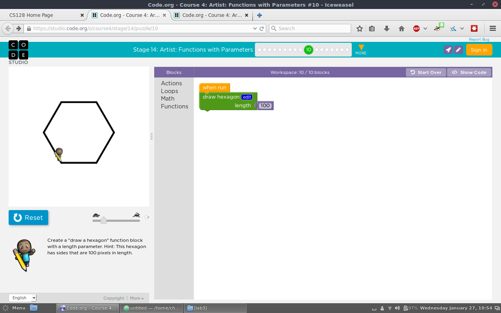
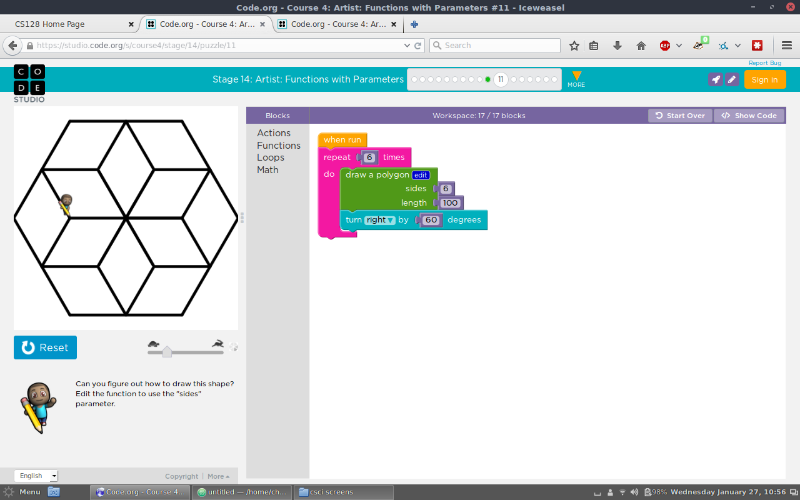
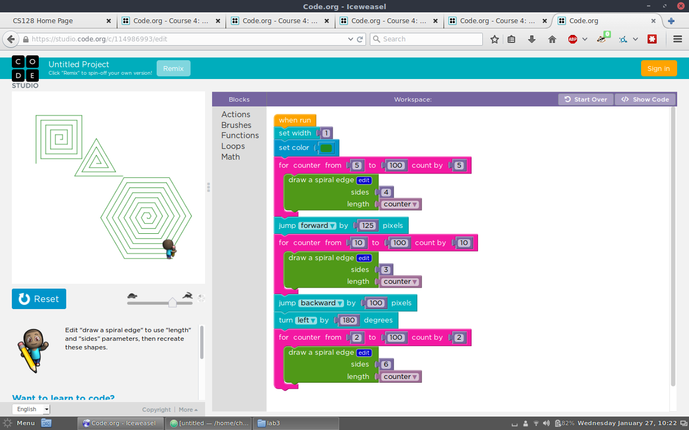
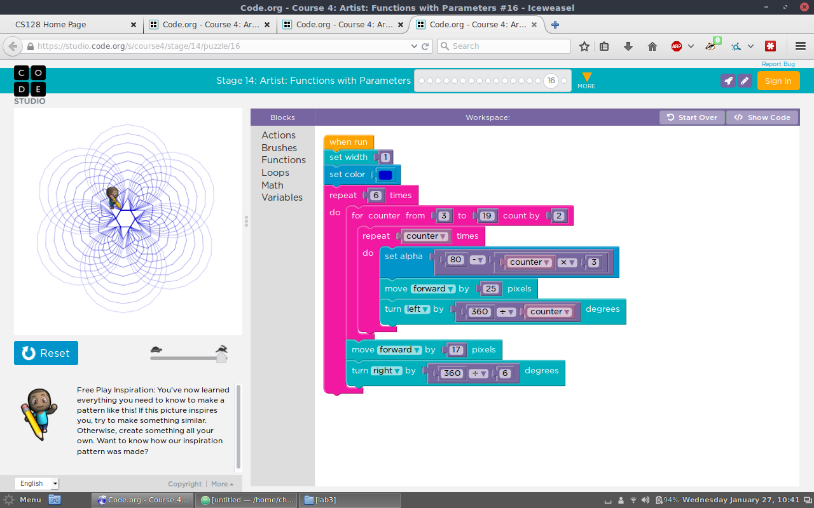

<!---
CS128 Lab 3
--->

# CSCI 128 Labs Week Three

## Lab 3.1

##### Stage 14, Puzzle 10

Code:
```
var length2;

function draw_hexagon(length2) {
  for (var count = 0; count < 6; count++) {
    moveForward(length2);
    turnLeft(60);
  }
}

draw_hexagon(100);
```


##### Stage 14, Puzzle 11

Code:
```
var sides;
var length2;

function draw_a_polygon(sides, length2) {
  for (var count = 0; count < sides; count++) {
    moveForward(length2);
    turnLeft(360 / sides);
  }
}

for (var count2 = 0; count2 < 6; count2++) {
  draw_a_polygon(6, 100);
  turnRight(60);
}
```


##### Stage 14, Puzzle 15

Code:
```
var length2;
var sides;
var counter;

function draw_a_spiral_edge(length2, sides) {
  moveForward(length2);
  turnLeft(360 / sides);
}

penWidth(1);
penColour('#228b22');
for (counter = 5; counter <= 100; counter += 5) {
  draw_a_spiral_edge(counter, 4);
}
jumpForward(125);
for (counter = 10; counter <= 100; counter += 10) {
  draw_a_spiral_edge(counter, 3);
}
jumpBackward(100);
turnLeft(180);
for (counter = 2; counter <= 100; counter += 2) {
  draw_a_spiral_edge(counter, 6);
}
```


##### Stage 14, Puzzle 16

Code:
```
var length2;
var sides;
var counter;

function draw_a_polygon(length2, sides) {
  for (var count3 = 0; count3 < sides; count3++) {
    moveForward(length2);
    turnLeft(360 / sides);
  }
}

penWidth(1);
penColour('#0000cd');
for (var count2 = 0; count2 < 6; count2++) {
  for (counter = 3; counter <= 19; counter += 2) {
    for (var count = 0; count < counter; count++) {
      globalAlpha(80 - counter * 3);
      moveForward(25);
      turnLeft(360 / counter);
    }
  }
  moveForward(17);
  turnRight(360 / 6);
}
```

