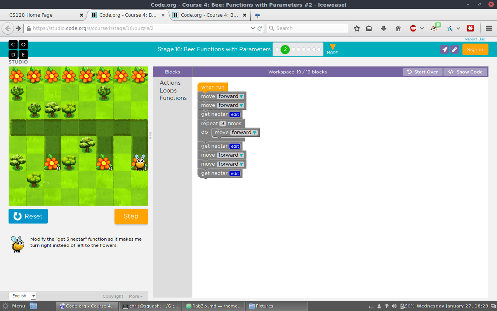
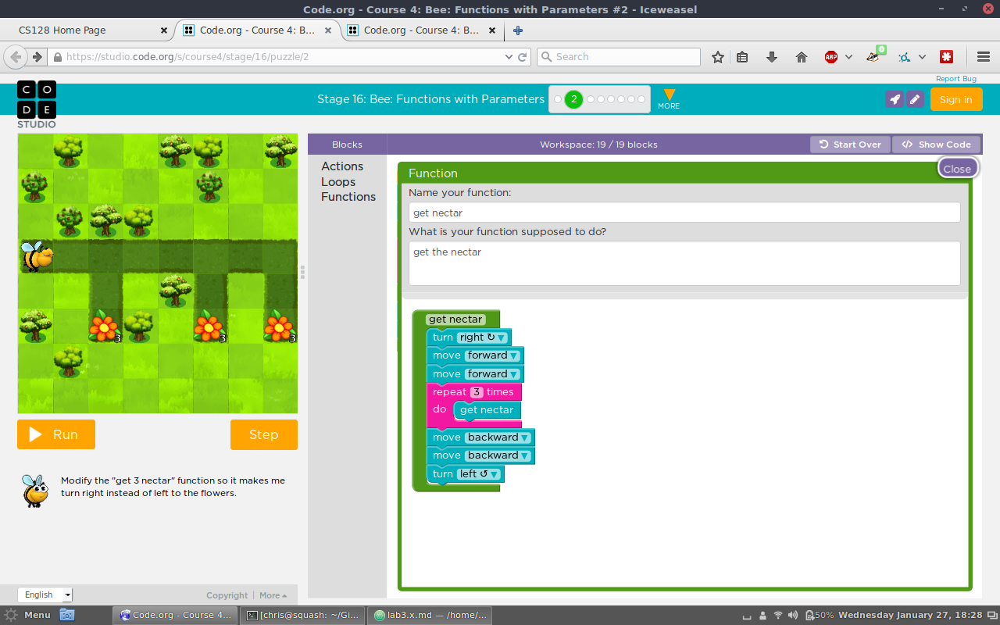
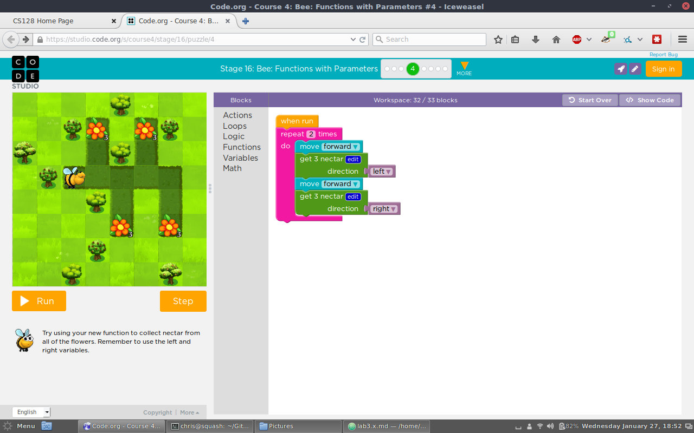
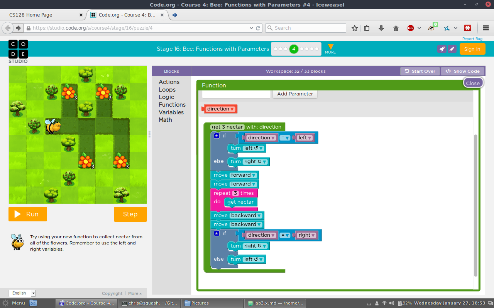
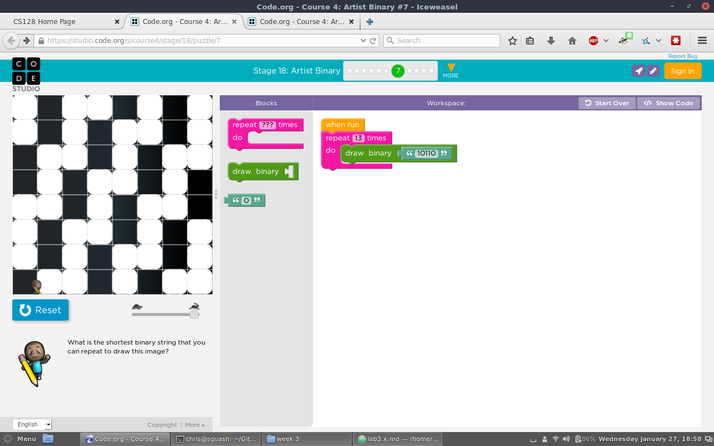
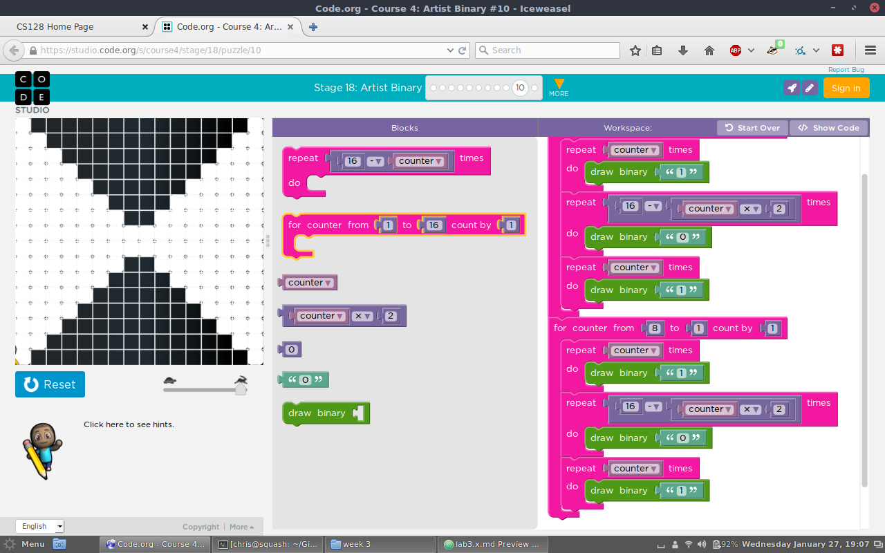

<!---
CS128 Lab 3
--->

# CSCI 128 Labs Week Three

## Lab 3.1

### Stage 14, Puzzle 10

##### Code:
```
var length2;

function draw_hexagon(length2) {
  for (var count = 0; count < 6; count++) {
    moveForward(length2);
    turnLeft(60);
  }
}

draw_hexagon(100);
```


### Stage 14, Puzzle 11

##### Code:
```
var sides;
var length2;

function draw_a_polygon(sides, length2) {
  for (var count = 0; count < sides; count++) {
    moveForward(length2);
    turnLeft(360 / sides);
  }
}

for (var count2 = 0; count2 < 6; count2++) {
  draw_a_polygon(6, 100);
  turnRight(60);
}
```


### Stage 14, Puzzle 15

##### Code:
```
var length2;
var sides;
var counter;

function draw_a_spiral_edge(length2, sides) {
  moveForward(length2);
  turnLeft(360 / sides);
}

penWidth(1);
penColour('#228b22');
for (counter = 5; counter <= 100; counter += 5) {
  draw_a_spiral_edge(counter, 4);
}
jumpForward(125);
for (counter = 10; counter <= 100; counter += 10) {
  draw_a_spiral_edge(counter, 3);
}
jumpBackward(100);
turnLeft(180);
for (counter = 2; counter <= 100; counter += 2) {
  draw_a_spiral_edge(counter, 6);
}
```


### Stage 14, Puzzle 16

##### Code:
```
var length2;
var sides;
var counter;

function draw_a_polygon(length2, sides) {
  for (var count3 = 0; count3 < sides; count3++) {
    moveForward(length2);
    turnLeft(360 / sides);
  }
}

penWidth(1);
penColour('#0000cd');
for (var count2 = 0; count2 < 6; count2++) {
  for (counter = 3; counter <= 19; counter += 2) {
    for (var count = 0; count < counter; count++) {
      globalAlpha(80 - counter * 3);
      moveForward(25);
      turnLeft(360 / counter);
    }
  }
  moveForward(17);
  turnRight(360 / 6);
}
```


## Lab 3.2

### Stage 16, Puzzle 2

##### Code:
```
function get_nectar() {
  turnRight();
  moveForward();
  moveForward();
  for (var count = 0; count < 3; count++) {
      getNectar();
  }
  moveBackward();
  moveBackward();
  turnLeft();
}

moveForward();
moveForward();
get_nectar();
for (var count2 = 0; count2 < 3; count2++) {
  moveForward();
}
get_nectar();
moveForward();
moveForward();
get_nectar();
```



### Stage 16, Puzzle 4
##### Code:
```
var direction;
var left;
var right;

function get_3_nectar(direction) {
  if (direction == left) {
    turnLeft();
  } else {
    turnRight();
  }

  moveForward();
  moveForward();
  for (var count = 0; count < 3; count++) {
      getNectar();
  }
  moveBackward();
  moveBackward();
  if (direction == left) {
    turnRight();
  } else {
    turnLeft();
  }

}

left = 0;
right = 1;

for (var count2 = 0; count2 < 2; count2++) {
  moveForward();
  get_3_nectar(left);
  moveForward();
  get_3_nectar(right);
}
```




## Lab 3.3

### Stage 16, Puzzle 7

##### Code:
```
var binary;
var bit;
var i;

function draw(binary) {
  if (!bit) {
    bit = 0;
  }
  var i_end = binary.length;
  var i_inc = 1;
  if (1 > i_end) {
    i_inc = -i_inc;
  }
  for (i = 1;
       i_inc >= 0 ? i <= i_end : i >= i_end;
       i += i_inc) {
    if (binary.charAt(i - 1) == 1) {
      draw_bit();
    }
    jumpForward(50);
    bit = bit + 1;
    if (bit > 7) {
      jumpBackward(400);
      turnRight(90);
      jumpForward(50);
      turnLeft(90);
      bit = 0;
    }
  }
}

function draw_bit() {
  penColour('#ffffff');
  penWidth(25);
  for (var count2 = 0; count2 < 4; count2++) {
    moveForward(25);
    turnRight(90);
  }
}

for (var count = 0; count < 13; count++) {
  draw('10110');
}
```


### Stage 16, Puzzle 10
##### Code:
```
var binary;
var counter;
var bit;
var i;

function draw(binary) {
  if (!bit) {
    bit = 0;
  }
  var i_end = binary.length;
  var i_inc = 1;
  if (1 > i_end) {
    i_inc = -i_inc;
  }
  for (i = 1;
       i_inc >= 0 ? i <= i_end : i >= i_end;
       i += i_inc) {
    if (binary.charAt(i - 1) == 1) {
      draw_bit();
    }
    jumpForward(25);
    bit = bit + 1;
    if (bit > 15) {
      jumpBackward(400);
      turnRight(90);
      jumpForward(25);
      turnLeft(90);
      bit = 0;
    }
  }
}

function draw_bit() {
  penColour('#ffffff');
  penWidth(12.5);
  for (var count7 = 0; count7 < 4; count7++) {
    moveForward(12.5);
    turnRight(90);
  }
}

for (counter = 1; counter <= 8; counter++) {
  for (var count = 0; count < counter; count++) {
    draw('1');
  }
  var repeat_end = 16 - counter * 2;
  for (var count2 = 0; count2 < repeat_end; count2++) {
    draw('0');
  }
  for (var count3 = 0; count3 < counter; count3++) {
    draw('1');
  }
}
for (counter = 8; counter >= 1; counter--) {
  for (var count4 = 0; count4 < counter; count4++) {
    draw('1');
  }
  var repeat_end2 = 16 - counter * 2;
  for (var count5 = 0; count5 < repeat_end2; count5++) {
    draw('0');
  }
  for (var count6 = 0; count6 < counter; count6++) {
    draw('1');
  }
}
```


## Lab 3.4

Define a function in python to sum the numbers in a range of two numbers: start and end.

```
def sum_of_range(start,end):
  sum = 0
  count = 0
  for num in range(start,end+1):
      sum = sum+num
      count = count+1
  return sum
```
