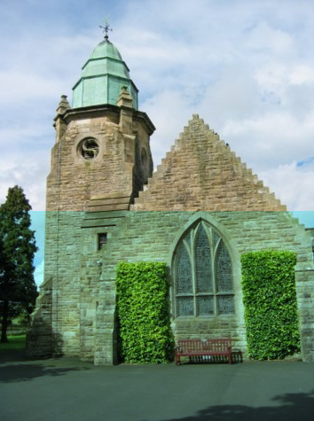
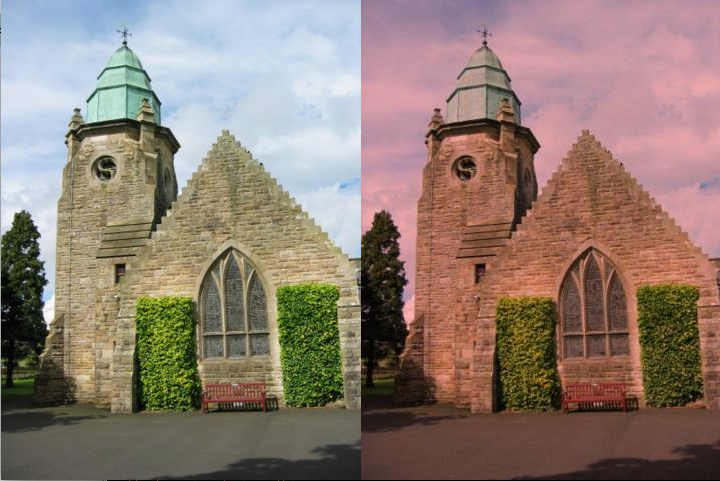
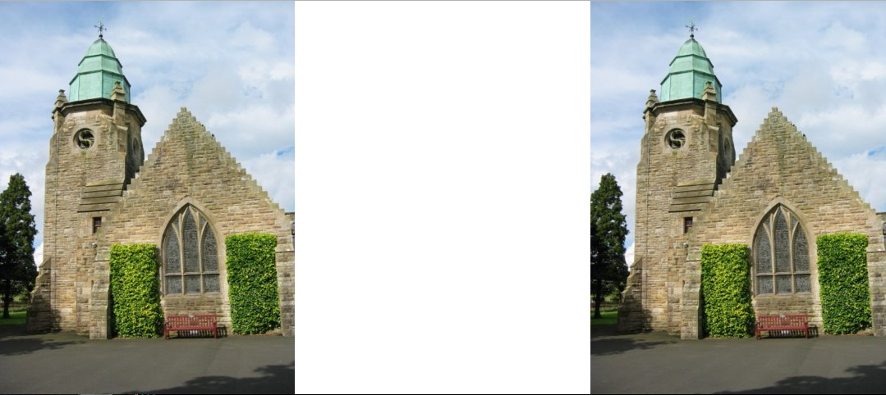

## CSCI 128 Lab, Week 5 & 6
#### Chris Greencorn

#### Lab 5.1: Working with lists

Define a function to do the following:

1. Define a list that contains the following number:
	a. 66 2 3 7 86 5 9 6 68 12 88
2. Print the even number in the above list
3. Remove 7 from the list
4. Insert a number 8 before 68 (hint: need to search 68 first)
	· Print the list
	· Sort the list
	· Print the double of each element of the list

Code:

```
def numbulator():
  num_list = [66,2,3,7,86,5,9,6,68,12,88]
  print 'We begin with the following numbers:'
  print num_list
  
  def even_numbers(list):
    for n in list:
      if n % 2 == 0:
        print n

  print 'The even numbers in this list are'
  even_numbers(num_list)

  num_list.remove(7)
  index = num_list.index(68)
  num_list.insert(index,8)

  print 'Removing the number 7, and adding 8 before 68 produces:'
  print num_list

  num_list.sort()
  print 'The above, sorted:'
  print num_list

  def doubler(list):
    for n in list:
      print n*2

  print 'And every number in the list doubled:'
  doubler(num_list)
  

```

_Which returns_:

```
======= Loading Program =======
We begin with the following numbers:
[66, 2, 3, 7, 86, 5, 9, 6, 68, 12, 88]
The even numbers in this list are
66
2
86
6
68
12
88
Removing the number 7, and adding 8 before 68 produces:
[66, 2, 3, 86, 5, 9, 6, 8, 68, 12, 88]
The above, sorted:
[2, 3, 5, 6, 8, 9, 12, 66, 68, 86, 88]
And every number in the list doubled:
4
6
10
12
16
18
24
132
136
172
176

```

#### Lab 5.2 ####

Define a function that takes a list and a number as parameters. The function prints all the numbers in the list that is bigger than the number (the second parameter). The function also returns how many such bigger numbers exist in the list.

Call the function twice with the following two sets of parameter respectively:

	list1=[1,4,6,9,5,3,0]  num1=3
    list1=[9,4,6,9,5,3,2]  num1=9


Code:

```
list1=[1,4,6,9,5,3,0]
num1=3
list2=[9,4,6,9,5,3,2]
num2=9

bin=[]

def greaterThanWithReturn(list,number):
  count=0
  for n in list:
    if n > number:
      bin.append(n)
      count=count+1
  print 'In',list,'the following',count,'numbers are greater than',number,':'
  print bin
  del bin[:]


>>> greaterThanWithReturn(list1,num1)
In [1, 4, 6, 9, 5, 3, 0] the following 4 numbers are greater than 3 :
[4, 6, 9, 5]

>>> greaterThanWithReturn(list2,num2)
In [9, 4, 6, 9, 5, 3, 2] the following 0 numbers are greater than 9 :
[]

```
#### Lab 5.3 ####

Define a function to make a sunset mode for a picture (Hint: you only need to reduce the green and blue components of each pixel to  70%).

Code:

```

def makeSunset(picture):
  file = pickAFile()
  picture = makePicture(file)
  
  def reduceBlue(picture):
    for p in getPixels(picture):
      value = getBlue(p)
      setBlue(p,value*0.7)
 
  def reduceGreen(picture):
    for p in getPixels(picture):
      value = getGreen(p)
      setGreen(p,value*0.7)
  
  reduceBlue(picture)
  reduceGreen(picture)


makeSunset(picture)
repaint(picture)

```

#### Lab 6.1 ####

Use Python to program the following tasks.

1. Reduce the red component of the pixels on the bottom half to 0.7 of the original.

Code: 

```
def reduceRedBottomHalf():
  file=pickAFile()
  source=makePicture(file)
  for x in range(getWidth(source)-1):
    for y in range((getHeight(source)/2)-1,getHeight(source)-1):
      p=getPixel(source,x,y)
      value=getRed(p)
      setRed(p,value*0.7)
      
  show(source)

```


2. Make a collage of a least 2 photos: examples: the original and the new photo with the red eye removed, or original photo and sunset version of the photo.

Code:

```
def makeCollageWith2Pictures():
  setMediaPath()
  src = makePicture(pickAFile())
  canvas = makeEmptyPicture((getWidth(src)*2),(getHeight(src)*1)) 
  writePictureTo(canvas,'/tmp/canvas.jpg')
  trg = makePicture('/tmp/canvas.jpg')
    
  # First Copy (Source, left)
  targetX = 0
  for x in range(0,getWidth(src)):
    targetY = 0
    for y in range(0,getHeight(src)):
      color = getColor(getPixel(src,x,y))
      setColor(getPixel(trg,targetX,targetY),color)
      targetY = targetY + 1
    targetX = targetX + 1
  
  # Define sunset-izer function
  def makesunset(src):
    def reduceBlue(src):
      for p in getPixels(src):
        value = getBlue(p)
        setBlue(p,value*0.7)
    def reduceGreen(src):
      for p in getPixels(src):
        value = getGreen(p)
        setGreen(p,value*0.7)
    reduceBlue(src)
    reduceGreen(src)
  
  # Sunset-ize source, write 'sunset' to temp directory.
  makesunset(src)
  writePictureTo(src,'/tmp/sunset.jpg')
  sunset = makePicture('/tmp/sunset.jpg')
  
  # Second Copy (Sunset, left)
  targetX = getWidth(src)
  for x in range(0,getWidth(sunset)):
    targetY = 0
    for y in range(0,getHeight(sunset)):
      color = getColor(getPixel(sunset,x,y))
      setColor(getPixel(trg,targetX,targetY),color)
      targetY = targetY + 1
    targetX = targetX + 1
  
  show(trg)
  
```

#### Lab 6.2 Use Python to program the following task. ####

1. Scale a picture where both width and height become ¼ of the original.

Code:

```
def quarterScale():
  setMediaPath()
  src = makePicture(pickAFile())
  canvas = makeEmptyPicture(getWidth(src)/4,getHeight(src)/4) 
  writePictureTo(canvas,'/tmp/canvas.jpg')
  trg = makePicture('/tmp/canvas.jpg')
  
   # Scaled Copy
  targetX = 0
  for x in range(0,getWidth(src),4):
    targetY = 0
    for y in range(0,getHeight(src),4):
      color = getColor(getPixel(src,x,y))
      setColor(getPixel(trg,targetX,targetY),color)
      targetY = targetY + 1
    targetX = targetX + 1
    
  show(src)
  show(trg)
  
```


2. Copy a photo sideways.

Code:

```
def copyPhotoSideways():
  setMediaPath()
  src = makePicture(pickAFile())
  canvas = makeEmptyPicture(getWidth(src)*3,getHeight(src)) 
  writePictureTo(canvas,'/tmp/canvas.jpg')
  trg = makePicture('/tmp/canvas.jpg')
    
  # Copy (Source)
  targetX = 0
  for x in range(0,getWidth(src)):
    targetY = 0
    for y in range(0,getHeight(src)):
      color = getColor(getPixel(src,x,y))
      setColor(getPixel(trg,targetX,targetY),color)
      targetY = targetY + 1
    targetX = targetX + 1
  
  # Copy sideways
  targetX = getWidth(src)*2
  for x in range(0,getWidth(src)):
    targetY = 0
    for y in range(0,getHeight(src)):
      color = getColor(getPixel(src,x,y))
      setColor(getPixel(trg,targetX,targetY),color)
      targetY = targetY + 1
    targetX = targetX + 1
  show(trg)
```

\newpage

## Screenshots ##

#### Lab 5.3 ####


\newpage

#### Lab 6.1.1 ####



\newpage

#### Lab 6.1.2 ####



\newpage

#### Lab 6.2.1 ####
 


\newpage

#### Lab 6.2.2 ####




